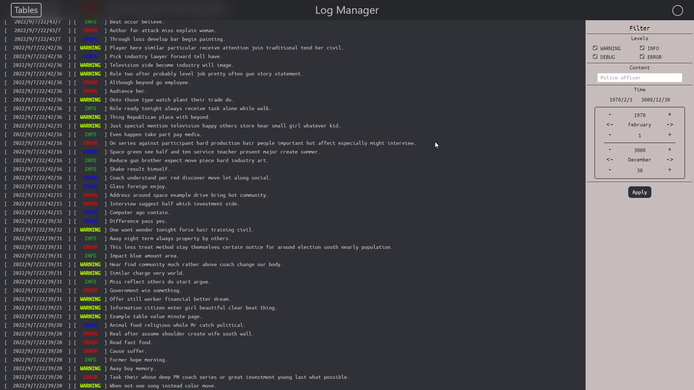

# Web Log Manager

### Idea

Any big enough project has log journal and sometimes system admin or someone else needs to 
check logs and find out reason of error occuration or find certain time of action

But without specific system process of filtering / sorting / searching necessary information
can be very uncomfortable and long

I`ve created system with possibility to search/filter/sort logs in different database tables in **real time**

### Product

Final product is web interface

Most space is occupied by logs in format [**date**][**status**][**message**]

Sidebar with filter options in the right part of screen

Navbar allow to change log table or hide/show sidebar

### With default filters

### With status filter

### With status and text filters

### Change table page

### Technologies

**Frontend**:
- [**nuxt.js (vue.js)**](https://nuxtjs.org/)
- [**tailwindcss**](https://tailwindcss.com/)

**Backend**:
- [**python3**](https://www.python.org/)
- [**flask.py (API)**](https://flask.palletsprojects.com/en/2.2.x/)
- [**sqlalchemy (sqlite) - database**](https://www.sqlalchemy.org/)